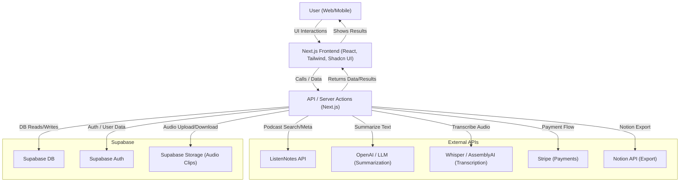

# System Architecture: AI Podcast Summarizer MVP

---

- All user actions flow through the Next.js frontend and server actions.
- Supabase handles authentication, database, and audio storage.
- ListenNotes provides podcast search and episode metadata.
- OpenAI/LLM and Whisper/AssemblyAI handle summarization and transcription.
- Stripe manages payments (subscription/one-time).
- Notion API is used for exporting summaries. 